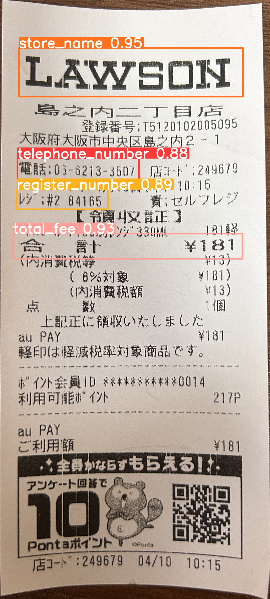
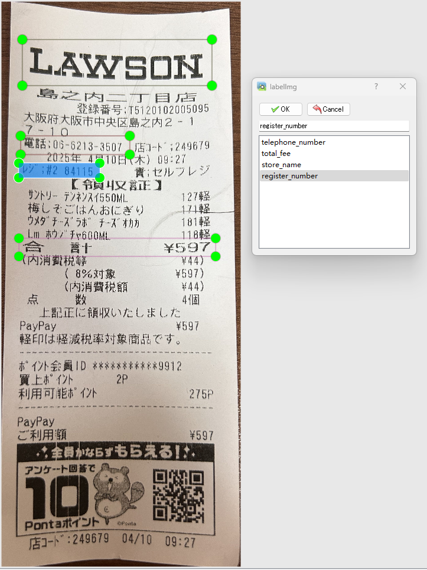
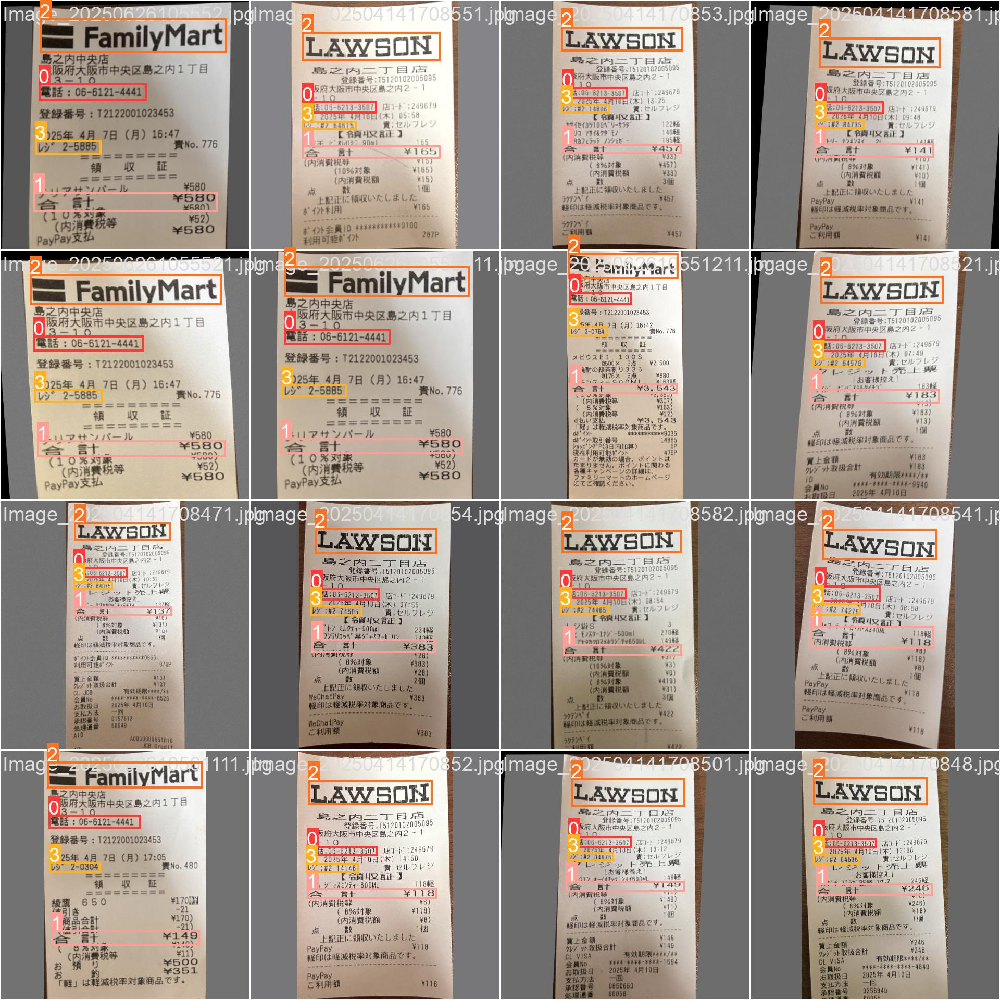
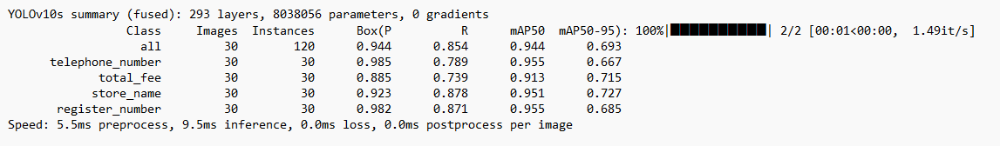
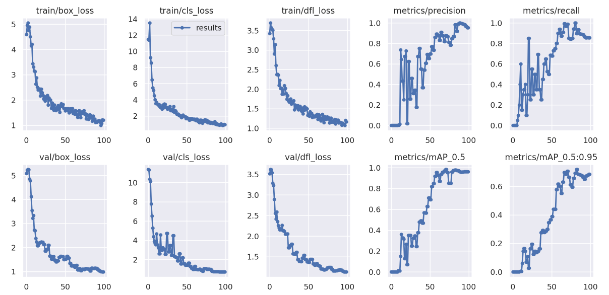

# コンビニのレシート内容検出モデル

---

## 1. プロジェクト概要

本プロジェクトは、[YOLOv10][YOLOv10]を用いた画像物体検出のディープラーニングプロジェクトです。  
レシート上の4種類の文字情報を対象として物体検出を行います。データ準備、学習、推論、および結果評価の一連の流れをカバーしています。

---

### 結果の表示

下図は本プロジェクトにおける結果の一例です。  
学習を経たモデルは、レシート内の4種類のラベルを正確に認識・検出できるようになっています。  

---

### YOLOv10について

[YOLOv10][YOLOv10]は清華大学の研究者によってパッケージ化され、リアルタイム物体検出に新たなアプローチを導入しました。  
従来のYOLOシリーズで見られた後処理やモデルアーキテクチャの欠点を改善し、計算コストを大幅に削減しつつ、最先端の性能を達成しています。  
幅広い実験により、複数のモデルスケールにわたって優れた精度と遅延のトレードオフが実証されています。  

---

## 2. プロジェクト構成

<pre>
.
├── config/           # プロジェクト内の各種パラメータを定義したyamlファイル
├── data/             # 学習用および推論用の画像データ（画像ファイルやラベル情報を含む）
├── images/           # README用の画像
├── logs/             # 事前学習済みモデルおよび学習済みモデルの保存フォルダ
├── runs/detect/      # 学習・推論によって生成されたファイルを保存するフォルダ
├── yolo10/           # YOLOv10関連コードのフォルダ
├── requirements.txt  # Pythonの依存関係リスト
├── predict.py        # 推論スクリプト
├── train.py          # 学習スクリプト
└── README.md         # プロジェクト説明ドキュメント
</pre>

---

## 3. データ準備

コンビニのレシート135枚（自前で保有）を使用して学習および推論を行います。  
そのうち、学習用が100枚、検証用が30枚、テスト用が5枚です。  
「店舗名」、「電話番号」、「合計金額」、「レジ番号」の4種類のラベルを設定し、アノテーション・学習・推論を行います。  

---

### アノテーション

本プロジェクトでは[labelImg][labelImg]を用いてアノテーションを行いました。  
[labelImg][labelImg]をローカルにセットアップして起動し、下図のように学習セットおよび検証セットのレシート画像上で対象物を囲み、4種類のラベルを付与しました。  

アノテーション完了後、学習用・検証用画像およびラベルファイル、テスト用画像をそれぞれ `data/` 内の `train/`、`val/`、`test/` フォルダに配置し、以降の学習および推論時に使用できるようにしました。  
本プロジェクトでは、画像構造が比較的シンプルなコンビニレシートの物体検出を行うため、比較的軽量なYOLOv10s構造を採用しました。  
また、学習の高速化と安定性向上のため、学習前にYOLOv10sの事前学習済みモデルを `logs/` フォルダに配置し、学習時に読み込めるように準備しました。  

---

## 4. モデル学習

Google Colabが無料でGPUを提供しているため、本プロジェクトのモデル学習はGoogle Colab上で行いました。  
Google Colab上での環境設定については、[レシートの分類モデルのREADME.md](https://github.com/kakoubou/classification_model/blob/main/README.md#4-モデル学習)を参照してください。  
コードやデータのアップロード、Python依存関係のインストールなど環境設定が完了した後、[train.py](./train.py)を実行することでモデル学習を開始できます。  
本プロジェクトは文字に関する物体検出であるため、学習データセットに対する水増しでは、YOLOでよく使用されるMosaic水増し手法を使用せず、文字データにより適した[albumentations][albumentations]を用いています。  
以下の図は、[albumentations][albumentations]による水増しを行った後の画像例で、モーションブラー、ガウスノイズ、幾何変換、圧縮によるノイズなどが含まれています。  

100 epochの学習後、モデルの訓練が完了しました。  
最終的に各ラベルのmAP50は0.9以上、mAP50-95は約0.7となり、学習済みモデルが検証データセット上で良好な性能を示していることがわかります。  

---

## 5. テスト／推論

学習完了後、モデルは `runs/detect/` に保存されます。  
[predict.py](./predict.py) を実行することで、学習済みモデルを呼び出し、 `test/` 内のテストデータを読み込んで推論を行います。  
以下の画像は一部のテストデータに対する推論結果を示しています。  
結果として、レシート内のすべてのラベル項目が検出され、高い信頼度で認識されていることが確認できます。  

---

## 6. 付録

- 物体検出アルゴリズム：[YOLOv10][YOLOv10]
- アノテーションツール：[labelImg][labelImg]
- 水増し手法：[albumentations][albumentations]

[YOLOv10]: https://github.com/THU-MIG/yolov10
[labelImg]: https://github.com/HumanSignal/labelImg
[albumentations]: https://github.com/albumentations-team/albumentations

